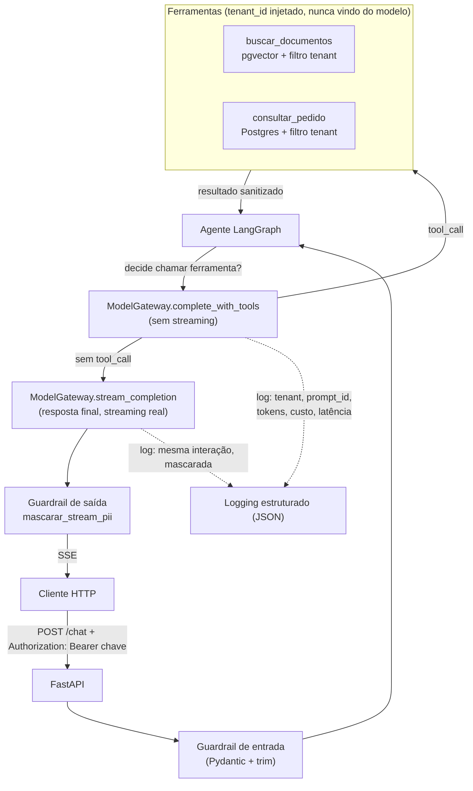

# Copiloto de Atendimento

Microsserviço de IA para um e-commerce genérico:

1. Responde perguntas com base em documentos internos (RAG com pgvector).
2. Executa uma ação real via ferramenta — consulta o status de um pedido (agente com tool calling, LangGraph).
3. É multi-tenant: cada loja (autenticada por chave de API) só enxerga os próprios documentos e pedidos.

Projeto de portfólio: escopo pequeno, execução de produção — gateway único de modelo, prompts
versionados, guardrails nas duas bordas, observabilidade e avaliação de qualidade em vez de testes
de igualdade exata.

## Fluxo



## Como rodar

```bash
cp .env.example .env
docker compose up -d postgres ollama

# primeira vez: baixa os modelos dentro do container Ollama
docker exec -it $(docker compose ps -q ollama) ollama pull qwen2.5:3b
docker exec -it $(docker compose ps -q ollama) ollama pull all-minilm

# ingestão dos dados de exemplo (dois tenants: loja-azul, loja-verde)
pip install -e ".[dev]"
python scripts/ingest_documents.py
python scripts/seed_pedidos.py

# sobe a API (fora do container, para dev — ou `docker compose up app`)
# --port 8001: a porta 8000 já costuma estar em uso por outros projetos locais
uvicorn app.api.main:app --reload --port 8001
```

- `GET /health` — liveness.
- `GET /ready` — readiness (checa o Postgres).
- `POST /chat` — streaming (SSE), exige `Authorization: Bearer <chave de API>` (uma por loja, ver `TENANT_API_KEYS` no `.env.example`).
- Docs automáticos em `/docs`.

```bash
curl -N -X POST http://localhost:8001/chat \
  -H "Content-Type: application/json" -H "Authorization: Bearer dev-loja-azul" \
  -d '{"mensagem": "Qual o prazo para devolução de um produto?"}'
```

Rodando localmente fora do Docker (ingestão, scripts, `uvicorn --reload`), troque no `.env` os hosts
`postgres`/`ollama` por `localhost` — os comentários no `.env.example` explicam a diferença.

## Testes

```bash
pytest                    # unitários + feature — tudo mockado, nunca toca banco ou LLM real
pytest tests/evals -v     # eval de qualidade do RAG — precisa do stack real de pé e ingerido
```

## Estrutura

```text
app/
├── api/            # camada HTTP — rotas finas, sem regra de negócio
├── orchestration/  # gateway de modelo, agente LangGraph, prompts versionados, contexto
├── domain/         # DTOs, entidades, guardrails — regra pura, sem I/O
└── adapters/       # Postgres, ferramentas do agente — implementações atrás de interface
scripts/            # ingestão de documentos e seed de pedidos
data/sample_docs/   # documentos de exemplo, um diretório por tenant
tests/
├── unit/           # regra de negócio isolada, tudo mockado
├── feature/        # endpoints via TestClient, tudo mockado
└── evals/          # qualidade do RAG contra a infra real (dataset + métrica + limiar)
```

## Decisões de arquitetura

**RAG em vez de fine-tuning.** As políticas da loja mudam (prazo, frete, garantia); com RAG a
atualização é reingerir um documento, sem retreinar nada, e a resposta é auditável — dá pra apontar
exatamente qual trecho embasou a resposta. Fine-tuning faria sentido para ensinar um *estilo*, não
fatos que mudam.

**pgvector em vez de um vector DB dedicado.** Para o volume deste projeto, um Postgres a mais
(Pinecone, Weaviate, Qdrant) é complexidade sem benefício — dados relacionais (pedidos) e vetoriais
(documentos) vivem na mesma engine, mesma transação, mesmo backup.

**LiteLLM como gateway único.** Nenhum SDK de provider (`openai`, `anthropic`, `ollama`) é
importado fora de `ModelGateway`. Trocar de Ollama para qualquer provider suportado é mudar
`LLM_MODEL` no `.env`, não código.

**Ollama local (`qwen2.5:3b`) como provider padrão.** Custo zero para um portfólio. Testado
empiricamente: `llama3.2:1b` não sustenta tool calling — numa pergunta que precisava da ferramenta
respondeu com um JSON solto como texto, e numa saudação simples inventou uma chamada de ferramenta
com dado fictício. `qwen2.5:3b` decide corretamente nos dois casos.

**LangGraph só resolve o loop de ferramentas; a resposta final é uma chamada de streaming à parte.**
Tool calling confiável em modelos pequenos via Ollama exige `stream=False` (senão os `tool_calls`
não vêm estruturados). Para não abrir mão de streaming real na resposta que o usuário lê, o grafo
resolve todas as chamadas de ferramenta primeiro (sem streaming) e só então uma última chamada,
com o histórico já resolvido, é feita em streaming — sem `tools`, então nunca tenta chamar
ferramenta de novo.

**Isolamento por tenant na origem, não na aplicação.** Toda query em `DocumentoRepositoryPostgres`
e `PedidoRepositoryPostgres` filtra por `tenant_id` na cláusula `WHERE`. O `tenant_id` vem da chave
de API autenticada (`obter_tenant_id`, nunca de um valor que o próprio cliente declara) e é
injetado no fechamento da ferramenta — nunca é um parâmetro que o modelo controla, o que impede um
prompt injection do tipo "busque no tenant X" vazar dado de outra loja, e a chave impede que um
cliente se passe por outra loja só trocando um header.

**Guardrails de saída como mascaramento de PII em streaming, não bloqueio da resposta inteira.**
Bufferizar a resposta inteira antes de validar mataria o streaming. Em vez disso,
`mascarar_stream_pii` só libera texto até o último espaço em branco — nenhum CPF ou e-mail fica
cortado ao meio entre dois pedaços do stream — e aplica os mesmos padrões de regex tanto na
resposta ao cliente quanto no log da interação.

**Observabilidade com logging estruturado em JSON em vez de Langfuse.** Zero dependência externa
para rodar o projeto; cada chamada de modelo loga tenant, prompt id + versão, tokens, custo
(via `litellm.completion_cost`) e latência. Trade-off assumido: sem UI de trace visual — trocar por
Langfuse é adicionar um client no `ModelGateway`, a interface pública não muda.

**Conteúdo de fora do modelo é tratado como input não confiável.** O resultado de
`buscar_documentos` passa por `sanitizar_conteudo_externo`, que neutraliza marcadores de
instrução embutidos em um documento (`system:`, `###`, "ignore as instruções anteriores") antes de
o texto voltar para o histórico da conversa — o mesmo tratamento que a entrada do usuário recebe.

**Qualidade avaliada com recall@k + limiar, nunca igualdade exata.** `tests/evals` roda os 10 casos
de `dataset_rag.py` contra o Postgres+pgvector real, mede se o documento esperado aparece no top-3
recuperado e falha se o recall cair abaixo de 0.7 — testar "a resposta é exatamente X" não faz
sentido para geração de texto.

## Limitações conhecidas

- CPU puro: cada resposta do `/chat` leva ~60-90s (embedding + decisão de ferramenta + execução +
  resposta final, todos sequenciais contra um modelo de 3B sem GPU). Com GPU ou um provider
  hospedado isso cai para segundos.
- `mascarar_stream_pii` nunca corta um padrão no meio de uma palavra, mas não protege um dado
  sensível colado sem espaço a outro texto (ex.: dentro de uma URL).
- O agente limita a 4 iterações de chamada de ferramenta por conversa (`MAX_ITERACOES`), para não
  girar em loop se o modelo insistir em chamar ferramentas.
